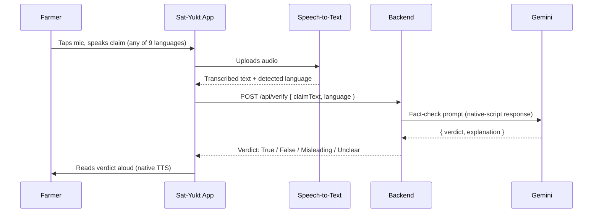
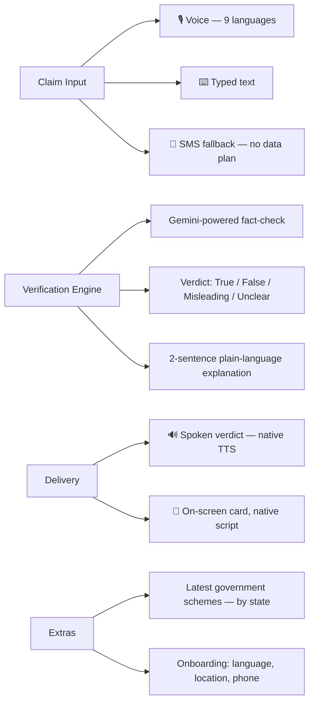
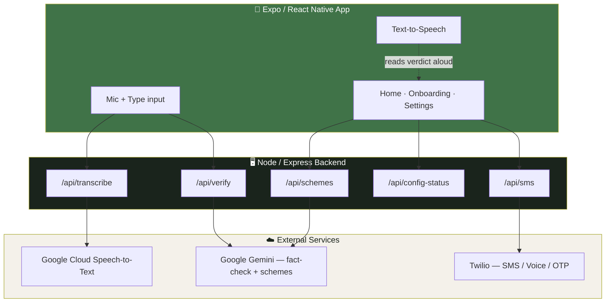

<div align="center">


# Sat-Yukt

**सही जानकारी, सबकी पहुंच में — Truth that reaches everyone**

A voice-first fact-checking app for rural India. Speak a claim, a scheme, or a
WhatsApp forward — in your own language — and get a clear, spoken verdict back.

</div>

---

## Why this exists

Misinformation about government schemes, crop advice, and viral WhatsApp
forwards spreads fastest exactly where fact-checking tools are least
accessible — among low-literacy, low-bandwidth users who don't read English
and don't type well. Sat-Yukt is built around **voice in, voice out**, in nine
Indian languages, so checking a claim takes no more effort than asking a
neighbor.

## How it works

<div align="center">



</div>

No typing required end to end — though a text input is always available as a
fallback for users who prefer it, or in noisy environments.

## Feature coverage



## Language coverage

Nine languages, chosen for combined reach across rural India — UI, voice
input, Gemini responses, and text-to-speech output all work natively in each,
not just translated labels.

| Language | Script | TTS |
|---|---|---|
| हिन्दी (Hindi) | Devanagari | ✅ |
| English | Latin | ✅ |
| मराठी (Marathi) | Devanagari | ✅ |
| தமிழ் (Tamil) | Tamil | ✅ |
| తెలుగు (Telugu) | Telugu | ✅ |
| বাংলা (Bengali) | Bengali | ✅ |
| ગુજરાતી (Gujarati) | Gujarati | ✅ |
| ਪੰਜਾਬੀ (Punjabi) | Gurmukhi | ✅ |
| ಕನ್ನಡ (Kannada) | Kannada | ✅ |

Device locale is auto-detected on first launch (falling back to Hindi, not
English — the stronger signal for this audience), and can be switched anytime
from the home screen.

## Architecture



All third-party API keys live **only** on the backend — the client never
talks to Gemini, Google STT, or Twilio directly, so no secret ever ships
inside the app bundle.

## Tech stack

- **Client**: Expo (React Native), TypeScript, NativeWind (Tailwind for RN), React Navigation
- **Backend**: Node.js, Express
- **Fact-checking**: Google Gemini
- **Speech-to-text**: Google Cloud Speech-to-Text (ffmpeg transcoding for phone audio)
- **Text-to-speech**: native platform TTS via `expo-speech`
- **SMS fallback**: Twilio

## Getting started

```bash
# Client
npm install
cp .env.example .env        # point EXPO_PUBLIC_BACKEND_URL at your backend
npx expo start --tunnel

# Backend
cd backend
npm install
cp .env.example .env        # add your Gemini / Google STT / Twilio keys
node server.js
```

Full setup instructions, including how to get each API key, are in
[SETUP.md](SETUP.md).

## Project structure

```
src/
  screens/          Home, onboarding flow, settings
  components/        MicButton, VerdictCard, LanguageSelector, SchemesCard...
  services/           API client, voice, verification, offline queue
  localization/       9-language string tables

backend/
  server.js           Express routes
  services/            Gemini, Speech-to-Text, Twilio providers
```

---

<div align="center">
<sub>Built for accessibility-first fact-checking in rural India.</sub>
</div>
